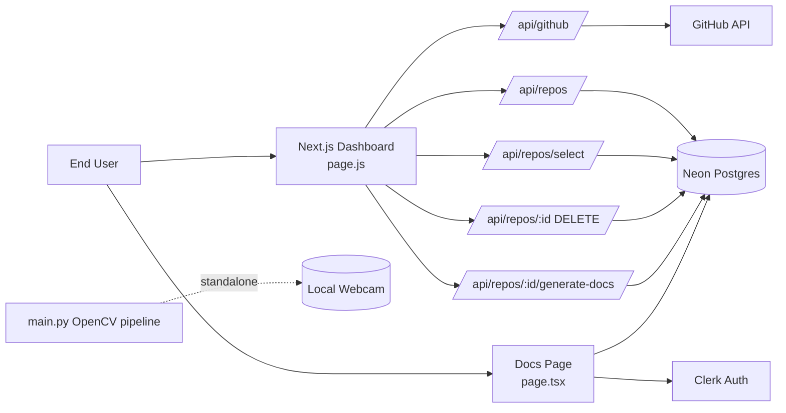
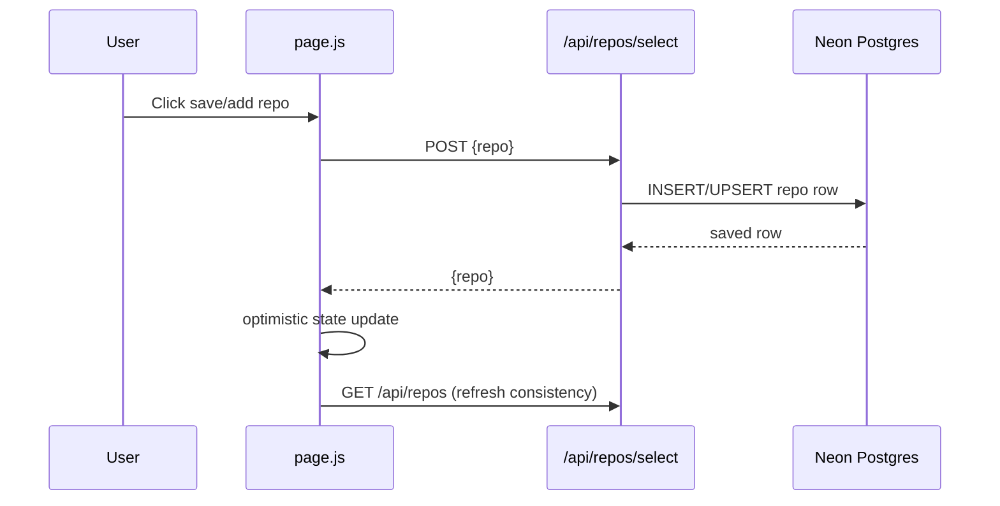
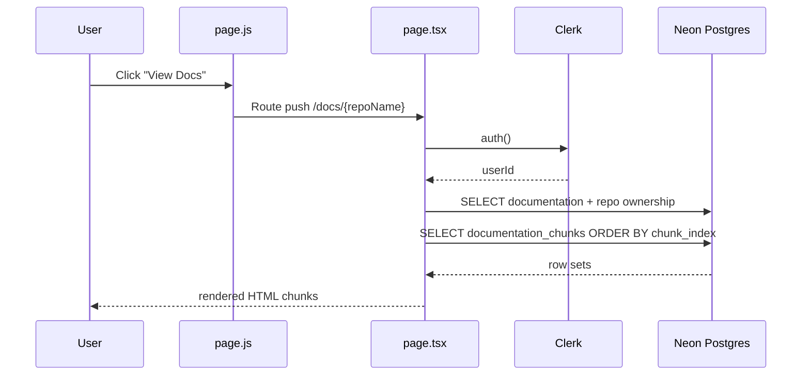
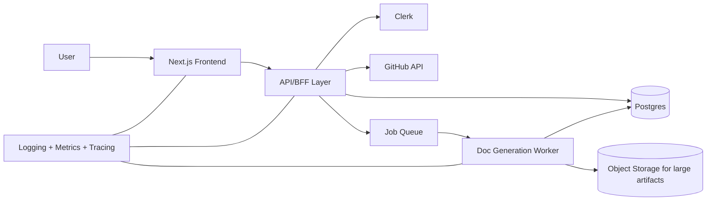
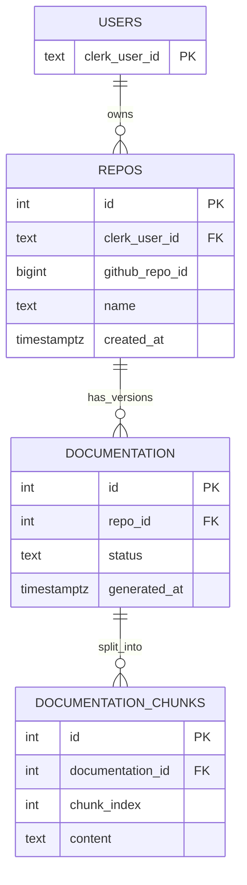

# AutoDocs System Design

## 1) Codebase Understanding (Current State)

This repository currently contains **two unrelated execution surfaces**:

1. A **Next.js UI + server-rendered documentation page** for AutoDocs product workflows.
2. A separate **OpenCV Python script** for yellow-color detection from webcam input.

### Current files and responsibilities

- `page.js`: Client-side dashboard to fetch GitHub repositories, persist selected repositories, and trigger/view documentation workflows through API endpoints. It also drives stateful UI (loading, success/error toasts, filtering, cards).  
- `page.tsx`: Server component for documentation detail pages with Clerk auth checks and Neon database reads (`documentation`, `repos`, and `documentation_chunks` joins/queries).  
- `create-table.js`: One-off script that provisions the `repos` table in Neon/Postgres.  
- `next.config.ts`: Basic Next.js config scaffold (no active customization).  
- `main.py`: Standalone OpenCV live webcam processing loop for yellow object segmentation.  

---

## 2) Context Diagram



> Note: API route files are referenced by usage in `page.js` but are not present in this repository snapshot.

---

## 3) Runtime Component Design

```mermaid
flowchart TB
    subgraph Frontend[Client Runtime]
      DASH[Dashboard Component\nReact state + handlers]
      RC[RepositoryCard]
      SB[Sidebar]
      TB[Topbar]
    end

    subgraph Server[Next.js Server Runtime]
      DOC[Documentation Page\nAuth + SQL queries]
      API[API Handlers\n(referenced, not in snapshot)]
    end

    subgraph Data[Data Layer]
      PG[(Neon Postgres)]
      GH[GitHub REST API]
      CL[Clerk]
    end

    DASH --> API
    DASH --> RC
    DASH --> SB
    DASH --> TB

    DOC --> CL
    DOC --> PG

    API --> PG
    API --> GH
```

---

## 4) Primary Request Flows

### A) Save repository flow



### B) View documentation flow



---

## 5) Data Model (Observed + Required)

### Observed schema (implemented)

`repos` table (from `create-table.js`):
- `id SERIAL PRIMARY KEY`
- `clerk_user_id TEXT NOT NULL`
- `github_repo_id BIGINT NOT NULL UNIQUE`
- `name TEXT NOT NULL`
- `github_token TEXT`
- `created_at TIMESTAMPTZ DEFAULT NOW()`

### Referenced schema (required by docs page)

Based on SQL in `page.tsx`, these tables are expected:

- `documentation`: at least `id`, `repo_id`, `generated_at`, and content metadata.
- `documentation_chunks`: at least `id`, `documentation_id`, `chunk_index`, `content`.

Because these tables are queried but not provisioned in this repository, deployment currently depends on out-of-band migrations.

---

## 6) Architectural Risks & Gaps

1. **Route/ID mismatch in docs navigation**: dashboard routes to `/docs/${repo.name}` while docs page expects numeric `params.id` and parses with `parseInt`, causing 404s for non-numeric names.
2. **Missing API route implementations in repo snapshot**: client calls `/api/github`, `/api/repos`, `/api/repos/select`, delete endpoint, and implied generate-docs endpoint.
3. **Potential XSS surface**: docs page renders chunk HTML via `dangerouslySetInnerHTML` without visible sanitization in the current snapshot.
4. **No migration ownership for all required tables**: only `repos` DDL is included.
5. **Mixed concerns in root**: OpenCV script (`main.py`) is unrelated to web app and can confuse deployment/runtime assumptions.

---

## 7) Professional Target Design

### Recommended bounded contexts

- **Web App Context**: Next.js app/router, dashboard UI, docs viewer.
- **Integration Context**: GitHub sync service, auth mapping, repository ingestion.
- **Documentation Generation Context**: async job queue + worker for parsing/indexing/chunking repositories.
- **Data Context**: Postgres with managed migrations and row-level ownership constraints.

### High-level target architecture



### Design principles

- **Async generation**: docs generation should be non-blocking and resumable.
- **Strict ownership checks**: always enforce `clerk_user_id` in data access paths.
- **Sanitize rendered HTML**: sanitize at generation-time and enforce CSP at render-time.
- **Schema-first evolution**: use migrations for all tables and indexes.
- **Clear repo boundaries**: move `main.py` to a separate directory/repository unless intentionally part of product.

---

## 8) Suggested Implementation Roadmap

1. **Correct routing contract**
   - Standardize docs route to `/docs/[id]` or make server page lookup by slug/repo name consistently.
2. **Add migrations**
   - Introduce migration files for `documentation` and `documentation_chunks` with indexes.
3. **Implement/verify all API handlers**
   - Add missing API routes or include them in this repo if currently elsewhere.
4. **Harden HTML rendering**
   - Add sanitizer pipeline and CSP; avoid unsafe HTML where possible.
5. **Introduce job system**
   - Queue-based generation with status tracking (`pending/running/failed/success`).
6. **Operational readiness**
   - Add structured logs, error taxonomy, tracing, and health checks.

---

## 9) Minimal ER Diagram (Target)


