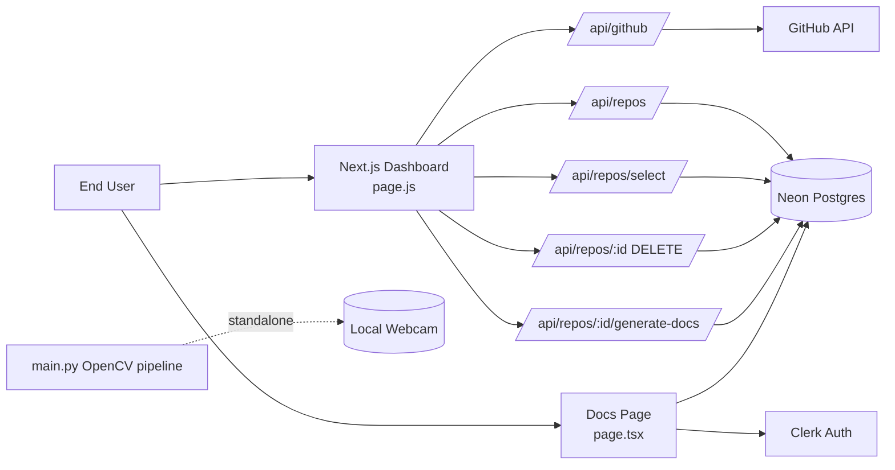
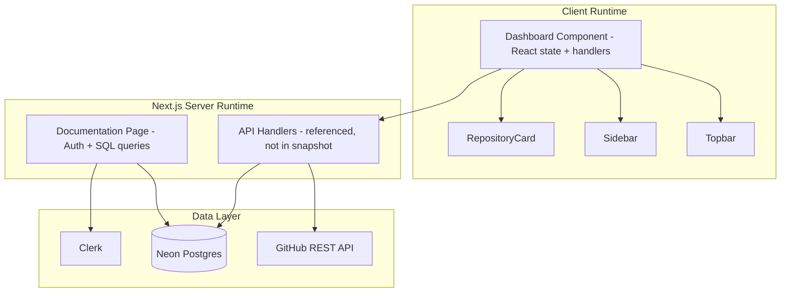
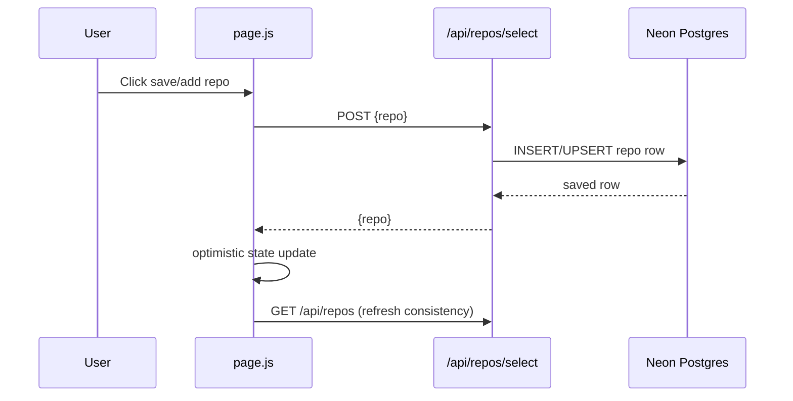
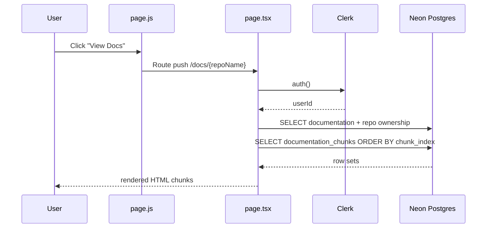
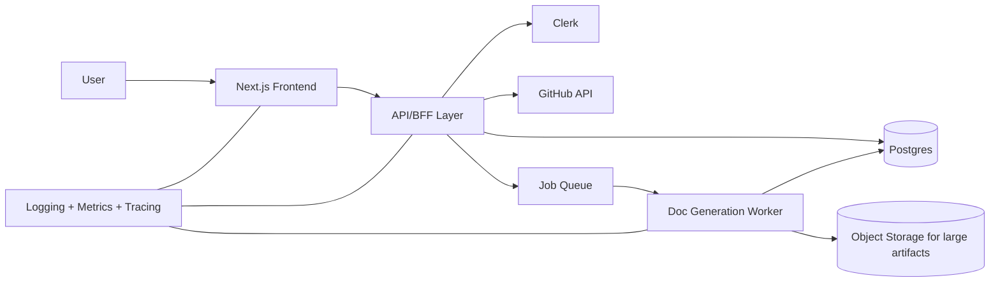

# AutoDocs System Design
AutoDocs is a web-based documentation orchestration system built using Next.js, Clerk authentication, and Neon Postgres. The application enables users to select GitHub repositories, persist them, and render structured documentation generated from repository data.

## Core Responsibilities

### Repository Management

- Fetch repositories from GitHub  
- Persist selected repositories to Postgres  
- Delete repositories  
- Trigger documentation generation workflows  

### Documentation Rendering

- Authenticate user via Clerk  
- Enforce repository ownership checks  
- Retrieve documentation metadata  
- Retrieve ordered documentation chunks  
- Render structured HTML output
  
### 1) Current files and responsibilities

- `page.js`: Client-side dashboard to fetch GitHub repositories, persist selected repositories, and trigger/view documentation workflows through API endpoints. It also drives stateful UI (loading, success/error toasts, filtering, cards).  
- `page.tsx`: Server component for documentation detail pages with Clerk auth checks and Neon database reads (`documentation`, `repos`, and `documentation_chunks` joins/queries).  
- `create-table.js`: One-off script that provisions the `repos` table in Neon/Postgres.  
- `next.config.ts`: Basic Next.js config scaffold (no active customization).  
- `main.py`: Standalone OpenCV live webcam processing loop for yellow object segmentation.  

## 2) Runtime Component Design

---

## 3) Primary Request Flows

### A) Save repository flow

### B) View documentation flow

### High-level target architecture

